# VR Game Flow Diagram

> **🔧 Updated: August 27, 2025**  
> **Production Ready**: Backend deployed on Render.com with PostgreSQL database  
> **New Features**: Backend Configuration System for Unity Integration  
> **Database**: Render PostgreSQL with automatic connection string parsing  
> **Changes**: Added `/api/config/game` and `/api/config/server` endpoints for production-ready Unity client setup

## Game Architecture Overview

```mermaid
graph TD
    %% CONFIGURATION PHASE (NEW - Unity Client Initialization)
    A[🎮 Unity VR Game Starts] --> A1["GET /api/config/server<br/>📡 Fetch server info & endpoints<br/>Returns: {serverVersion, endpoints, status}"]
    A1 -->|✅ 200 OK| A2["GET /api/config/game<br/>⚙️ Fetch game configuration<br/>Returns: {energy, trials, scoring settings}"]
    A2 -->|✅ 200 OK| A3["🔧 Apply Configuration Locally<br/>Set energy limits, trial timers<br/>Configure game mechanics"]
    A3 --> B{Player Status?}
    
    A1 -->|❌ Server Offline| A4["❌ Connection Failed<br/>🔄 Retry or use default config<br/>📱 Show offline mode"]
    A2 -->|❌ Config Failed| A4
    A4 --> B
    
    %% AUTHENTICATION PHASE
    B -->|New Player| C[📝 SIGNUP Screen]
    B -->|New Player| C[📝 SIGNUP Screen]
    B -->|Existing Player| D[🔐 LOGIN Screen]
    B -->|Already Logged In| I[🏠 Main Menu]
    
    C --> C1["POST /api/auth/register<br/>Body: {username, password}<br/>Returns: {token, username, playerId, expiresAt}"]
    C1 -->|200 OK| I
    C1 -->|409 Username Exists| C
    
    D --> D1["POST /api/auth/login<br/>Body: {username, password}<br/>Returns: {token, username, playerId, expiresAt}"]
    D1 -->|200 OK| I
    D1 -->|401 Invalid Credentials| D
    
    %% MAIN MENU
    I --> J{Menu Choice}
    J -->|New Game| K[🎯 Start New Game]
    J -->|View Stats| L[📊 Statistics Screen]
    J -->|Logout| M["POST /api/auth/logout<br/>Headers: Authorization Bearer token<br/>Returns: {message: 'Logged out successfully'}"]
    
    M --> A
    
    %% STATISTICS FLOW
    L --> L1["GET /api/game/player/username/sessions<br/>Headers: Authorization Bearer token<br/>Returns: All sessions + stats"]
    L1 --> L2[📈 Display VR Charts & History]
    L2 --> I
    
    %% GAME START - CREATE SESSION
    K --> K1["POST /api/game/start<br/>Headers: Authorization Bearer token<br/>Returns: {sessionId, playerId, username, wisdomEnergy: 50, currentTrial: 'start'}"]
    K1 --> N["🏁 Game Session Active<br/>Local State Management Begins<br/>sessionId stored locally"]
    
    %% TRIAL 1: PATIENCE (MIRRORS) - LOCAL ONLY
    N --> O["⏳ Trial 1: Patience Mirrors<br/>3D VR Mirrors + 60s Timer"]
    O --> O1[👀 Player observes in VR]
    O1 --> O2[✨ Mirrors become clear]
    O2 --> O3[🖱️ Player selects mirror 1, 2, or 3]
    O3 --> O4["💾 LOCAL STORAGE:<br/>Record patience trial choice<br/>with timing data"]
    
    %% TRIAL 2: RESOURCE (OLIVE TREE) - LOCAL ONLY
    O4 --> P["🌱 Trial 2: Resource Management<br/>VR Patience Grid + Olive Choice"]
    P --> P1[🔲 25-tile patience sequence in VR]
    P1 --> P2[⭐ Click golden square]
    P2 --> P3{🫒 Olive Tree Choice}
    P3 -->|Investment| P4["💾 LOCAL: Record plantOlive: true<br/>⚡ Start +1 energy/second timer"]
    P3 -->|Immediate| P5["💾 LOCAL: Record plantOlive: false<br/>💰 +50 energy immediately"]
    P4 --> Q
    P5 --> Q
    
    %% TRIAL 3: RISK (PATH CHOICE) - LOCAL ONLY
    Q["🛤️ Trial 3: Risk Management<br/>VR Path Selection Environment"]
    Q --> Q1{Path Choice in VR}
    Q1 -->|🛡️ Safe Path| Q2["💾 LOCAL: Record safePath: true<br/>💚 +50 energy guaranteed"]
    Q1 -->|⚡ Risky Path| Q3["💾 LOCAL: Record safePath: false<br/>🎲 Random: +100 or -100 energy"]
    Q2 --> R
    Q3 --> R
    
    %% GAME END - SINGLE BATCH SUBMISSION
    R["🏁 All Trials Complete<br/>Stop all timers<br/>Calculate final scores"] --> S["POST /api/game/submit-complete<br/>📤 BATCH SUBMISSION"]
    
    S --> S1["📦 Complete Payload:<br/>sessionId + finalGameState<br/>+ all playerChoices<br/>+ gameMetrics + deviceInfo"]
    
    S1 -->|✅ 200 OK| T["✅ Game Saved Successfully<br/>🎉 Show final VR results"]
    S1 -->|❌ Network Error| U["❌ Save Failed<br/>💾 Queue for retry<br/>🔄 Offline capability"]
    
    T --> V["GET /api/game/player/username/sessions<br/>🔄 Refresh statistics"]
    V --> W["📊 VR Statistics Display<br/>🏆 Rankings & Achievements"]
    W --> I
    
    U --> U1["⏰ Retry with backoff<br/>📱 Show retry status"]
    U1 --> S
    
    %% ERROR HANDLING
    U1 -->|Max Retries| U2["💾 Store offline<br/>🏠 Return to menu"]
    U2 --> I

    %% STYLING
    classDef apiCall fill:#e1f5fe,stroke:#01579b,stroke-width:3px,color:#000
    classDef gamePhase fill:#f3e5f5,stroke:#4a148c,stroke-width:3px,color:#000  
    classDef localAction fill:#e8f5e8,stroke:#1b5e20,stroke-width:2px,color:#000
    classDef errorState fill:#ffebee,stroke:#b71c1c,stroke-width:2px,color:#000
    classDef vrInterface fill:#fff3e0,stroke:#e65100,stroke-width:2px,color:#000
    classDef configPhase fill:#f1f8e9,stroke:#33691e,stroke-width:3px,color:#000
    
    class A1,A2,C1,D1,M,L1,K1,S,S1,V apiCall
    class A3,A4 configPhase
    class O,P,Q gamePhase
    class O4,P4,P5,Q2,Q3 localAction
    class U,U1,U2 errorState
    class O1,O2,O3,P1,P2,Q1,W vrInterface
```



## API Endpoints for Unity VR Integration

### 🔧 Configuration APIs (Unity Client Setup - Production Ready)

```http
GET /api/config/server
Base URL: https://athens-secret-api.onrender.com/api
Response: {
  "Success": true,
  "Data": {
    "ServerVersion": "1.0.0",
    "ApiVersion": "v1", 
    "ServerTime": "2025-08-27T12:00:00Z",
    "Environment": "Production",
    "DatabaseProvider": "PostgreSQL (Render)",
    "Status": {
      "IsHealthy": true,
      "ActiveSessions": 5,
      "HealthMessage": "Server is running normally"
    },
    "Endpoints": {
      "BaseUrl": "https://athens-secret-api.onrender.com/api",
      "Auth": {
        "Login": "/api/auth/login",
        "Register": "/api/auth/register"
      },
      "Game": {
        "Start": "/api/game/start",
        "GetState": "/api/game/{sessionId}/state",
        "SubmitComplete": "/api/game/submit-complete",
        "GetPlayerSessions": "/api/game/player/{username}/sessions"
      }
    },
    "Security": {
      "Jwt": {
        "ExpirationHours": 24,
        "Algorithm": "HS256"
      }
    }
  },
  "Message": "Server information retrieved successfully"
}
Status: 200 OK | 500 Server Error
```

```http
GET /api/config/game
Response: {
  "Success": true,
  "Data": {
    "Energy": {
      "StartingEnergy": 50,
      "MinEnergy": 0,
      "MaxEnergy": 1000,
      "EnergyCapWarningThreshold": 950
    },
    "Trials": {
      "Patience": {
        "TimerDurationSeconds": 60,
        "BonusThresholdSeconds": 30,
        "BonusEnergyAmount": 50,
        "NumberOfMirrors": 3,
        "CorrectMirrorLogic": "random"
      },
      "Resource": {
        "PatienceGridSize": 25,
        "ImmediateBonusEnergy": 50,
        "OliveInvestment": {
          "EnableInvestment": true,
          "Formula": "sqrt",
          "FormulaMultiplier": 1.0,
          "MaxBonusCap": 100,
          "UpdateIntervalMs": 1000,
          "MaxInvestmentDurationSeconds": 300
        }
      },
      "Risk": {
        "NumberOfPaths": 2,
        "SafePath": {
          "EnergyModifier": 10,
          "SuccessRate": 1.0
        },
        "RiskyPath": {
          "EnergyModifier": 25,
          "SuccessRate": 0.7,
          "FailurePenalty": -15
        }
      }
    },
    "Timing": {
      "GameSessionTimeoutMinutes": 30,
      "InactivityTimeoutMinutes": 10,
      "AutoSaveIntervalSeconds": 30
    },
    "Scoring": {
      "Weights": {
        "EnergyToScoreRatio": 1.0,
        "TimeCompletionBonus": 0.5,
        "PerfectTrialMultiplier": 1.5
      },
      "Bonuses": {
        "FirstTimeCompletionBonus": 100,
        "AllTrialsCompletedBonus": 200,
        "HighEnergyFinishBonus": 150,
        "HighEnergyThreshold": 200
      }
    }
  },
  "Message": "Game configuration retrieved successfully"
}
Status: 200 OK | 500 Server Error
```

### 🔐 Authentication APIs
```http
POST /api/auth/register
Content-Type: application/json
Body: {
  "username": "string",
  "password": "string"
}
Response: {
  "token": "jwt_token",
  "username": "string", 
  "playerId": "number",
  "expiresAt": "ISO_datetime_string"
}
Status: 200 OK | 409 Username Exists
```

```http
POST /api/auth/login
Content-Type: application/json
Body: {
  "username": "string",
  "password": "string" 
}
Response: {
  "token": "jwt_token",
  "username": "string",
  "playerId": "number",
  "expiresAt": "ISO_datetime_string"
}
Status: 200 OK | 401 Invalid Credentials
```

```http
POST /api/auth/logout
Headers: Authorization: Bearer {token}
Response: {
  "message": "Logged out successfully"
}
Status: 200 OK
```

### 🎮 Game Session APIs
```http
POST /api/game/start
Headers: Authorization: Bearer {token}
Response: {
  "sessionId": "number",
  "playerId": "number",
  "username": "string",
  "wisdomEnergy": 50,
  "currentTrial": "start", 
  "score": 0
}
```

```http
POST /api/game/submit-complete
Headers: Authorization: Bearer {token}
Content-Type: application/json
Body: {
  "sessionId": "number",
  "finalGameState": {
    "wisdomEnergy": "number",
    "score": "number", 
    "currentTrial": "completed"
  },
  "playerChoices": [
    {
      "trialType": "patience",
      "choice": "number (1-3)",
      "timestamp": "long",
      "waitedSeconds": "number",
      "hasWaitedEnough": "boolean"
    },
    {
      "trialType": "resource", 
      "choice": "boolean (plantOlive)",
      "timestamp": "long",
      "startedWisdomBonus": "boolean"
    },
    {
      "trialType": "risk",
      "choice": "boolean (safePath)",
      "timestamp": "long", 
      "energyChange": "number",
      "isSuccess": "boolean"
    }
  ],
  "gameMetrics": {
    "totalWisdomEnergyFromBonus": "number",
    "patienceWaitTime": "number", 
    "totalGameDuration": "number"
  },
  "clientStartTime": "ISO string",
  "clientEndTime": "ISO string",
  "totalGameDurationSeconds": "number",
  "deviceInfo": {
    "vrHeadset": "string",
    "controllers": "string[]",
    "platform": "string"
  }
}
Response: {
  "success": true,
  "message": "Game session completed successfully",
  "sessionId": "number",
  "score": "number",
  "finalWisdomEnergy": "number",
  "totalChoices": "number"
}
```

```http
GET /api/game/player/{username}/sessions
Headers: Authorization: Bearer {token}
Response: {
  "username": "string",
  "totalSessions": "number", 
  "sessions": [
    {
      "sessionId": "number",
      "wisdomEnergy": "number",
      "score": "number",
      "startTime": "ISO string",
      "endTime": "ISO string", 
      "isActive": "boolean",
      "currentTrial": "string"
    }
  ]
}
```

## Notes & Implementation Details

### 🔧 Configuration System
The game now uses a centralized `config.js` file for all settings:
- **API Base URL**: Easily switch between local/production servers
- **Game Mechanics**: All numerical values configurable
- **Environment Detection**: Auto-detection of local vs production
- **Debug Settings**: Console logging toggles

**To deploy**: Simply update `CONFIG.API.BASE_URL` in `config.js`

### ⚡ Energy Bonus Formula (Square Root)
The olive tree investment now uses **√x formula** instead of linear +1/second:

**Formula**: `bonus = ⌊√(elapsed_seconds)⌋`

**Examples**:
- 4 seconds → ⌊√4⌋ = ⌊2.0⌋ = +2 energy
- 9 seconds → ⌊√9⌋ = ⌊3.0⌋ = +3 energy  
- 16 seconds → ⌊√16⌋ = ⌊4.0⌋ = +4 energy
- 25 seconds → ⌊√25⌋ = ⌊5.0⌋ = +5 energy

**Key Behavior**:
- Energy only increases when reaching **perfect squares**
- No fractional energy shown (waits for integer values)
- Growing gaps prevent infinite waiting (1→4→9→16→25 seconds)
- Player sees next milestone: "Next bonus in X seconds"

**Implementation**:
```javascript
const currentBonusInteger = Math.floor(Math.sqrt(elapsedSeconds));
if (currentBonusInteger > lastBonusShown) {
    // Award new energy point
    gameState.wisdomEnergy += (currentBonusInteger - lastBonusShown);
}
```

### 📊 Milestone Timeline
| Time (sec) | √Time | Energy Bonus | Gap to Next |
|------------|-------|--------------|-------------|
| 1          | 1.0   | +1           | 3 sec       |
| 4          | 2.0   | +2           | 5 sec       |
| 9          | 3.0   | +3           | 7 sec       |
| 16         | 4.0   | +4           | 9 sec       |
| 25         | 5.0   | +5           | 11 sec      |
| 36         | 6.0   | +6           | 13 sec      |
| 49         | 7.0   | +7           | 15 sec      |

This creates **diminishing returns** that encourage optimal play rather than infinite waiting.

### 🎮 Manual Trial Progression for Investment
When player selects **olive tree investment** (resource trial):

**Behavior**:
- Investment bonus starts immediately using √x formula
- Game **remains in resource trial** (does not auto-advance)  
- "Next Stage" button appears below investment section
- Energy updates continue until user clicks "Next Stage"
- Only then does the game progress to risk trial

**Implementation**:
```javascript
// Investment choice flow
if (plantOlive) {
    startWisdomEnergyBonus(); // Start √x energy gain
    showContinueButton(); // Show "Next Stage" button
    // DON'T advance trial automatically
} else {
    // Immediate choice auto-advances after 2 seconds
    setTimeout(proceedToRiskTrial, 2000);
}
```

**UI Components**:
- **Continue Button**: "➡️ Επόμενο Στάδιο" 
- **Stop Button**: "⏹️ Σταμάτημα Επένδυσης" (optional early stop)
- **Status Display**: Live energy count and next milestone info
- **Real-time Updates**: Status updates every 3 seconds

**Player Agency**: User controls when to stop investment and proceed, allowing for strategic timing decisions.

## Unity Implementation Notes

### 🔧 1. Configuration Management (NEW)
```csharp
// Unity C# Implementation Example
public class GameConfigManager : MonoBehaviour 
{
    [Header("Server Configuration")]
    public string serverBaseUrl = "http://localhost:5182/api";
    
    private GameConfig gameConfig;
    private ServerInfo serverInfo;
    
    private async void Start()
    {
        await InitializeGameConfiguration();
    }
    
    private async Task InitializeGameConfiguration()
    {
        try 
        {
            // Step 1: Get server information
            serverInfo = await APIClient.GetServerInfo();
            Debug.Log($"Server Version: {serverInfo.ServerVersion}");
            Debug.Log($"API Version: {serverInfo.ApiVersion}");
            
            // Step 2: Fetch game configuration  
            gameConfig = await APIClient.GetGameConfig();
            
            // Step 3: Apply configuration to Unity game
            ApplyGameConfiguration(gameConfig);
            
            Debug.Log("✅ Game configuration loaded successfully");
        }
        catch (Exception ex)
        {
            Debug.LogError($"❌ Configuration failed: {ex.Message}");
            // Fall back to default configuration
            UseDefaultConfiguration();
        }
    }
    
    private void ApplyGameConfiguration(GameConfig config)
    {
        // Apply energy settings
        GameSettings.StartingEnergy = config.Energy.StartingEnergy;
        GameSettings.MaxEnergy = config.Energy.MaxEnergy;
        
        // Apply trial settings
        PatienceTrialSettings.TimerDuration = config.Trials.Patience.TimerDurationSeconds;
        PatienceTrialSettings.BonusThreshold = config.Trials.Patience.BonusThresholdSeconds;
        PatienceTrialSettings.BonusAmount = config.Trials.Patience.BonusEnergyAmount;
        
        // Apply olive investment formula
        ResourceTrialSettings.InvestmentFormula = config.Trials.Resource.OliveInvestment.Formula;
        ResourceTrialSettings.MaxInvestmentDuration = config.Trials.Resource.OliveInvestment.MaxInvestmentDurationSeconds;
        
        // Apply scoring configuration
        ScoringSystem.EnergyToScoreRatio = config.Scoring.Weights.EnergyToScoreRatio;
        ScoringSystem.PerfectTrialMultiplier = config.Scoring.Weights.PerfectTrialMultiplier;
    }
    
    private void UseDefaultConfiguration()
    {
        // Fallback configuration when server is unreachable
        GameSettings.StartingEnergy = 50;
        PatienceTrialSettings.TimerDuration = 60;
        // ... other defaults
        Debug.Log("⚠️ Using default configuration (offline mode)");
    }
}
```

### 🌐 2. API Client Implementation
```csharp
public static class APIClient 
{
    private static readonly HttpClient httpClient = new HttpClient();
    private static string baseUrl;
    
    public static void Initialize(string serverUrl)
    {
        baseUrl = serverUrl;
        httpClient.DefaultRequestHeaders.Add("Content-Type", "application/json");
    }
    
    public static async Task<ServerInfo> GetServerInfo()
    {
        var response = await httpClient.GetAsync($"{baseUrl}/config/server");
        response.EnsureSuccessStatusCode();
        
        var jsonResponse = await response.Content.ReadAsStringAsync();
        var apiResponse = JsonConvert.DeserializeObject<ApiResponse<ServerInfo>>(jsonResponse);
        
        if (apiResponse.Success)
        {
            return apiResponse.Data;
        }
        
        throw new Exception($"Server info fetch failed: {apiResponse.Message}");
    }
    
    public static async Task<GameConfig> GetGameConfig()
    {
        var response = await httpClient.GetAsync($"{baseUrl}/config/game");
        response.EnsureSuccessStatusCode();
        
        var jsonResponse = await response.Content.ReadAsStringAsync();
        var apiResponse = JsonConvert.DeserializeObject<ApiResponse<GameConfig>>(jsonResponse);
        
        if (apiResponse.Success)
        {
            return apiResponse.Data;
        }
        
        throw new Exception($"Game config fetch failed: {apiResponse.Message}");
    }
}
```

### 🎯 3. Unity Startup Flow (Updated)
```
1. Unity VR Game Launch
2. Initialize API Client with server URL
3. GET /api/config/server → Validate server connection
4. GET /api/config/game → Load game mechanics configuration  
5. Apply configurations to Unity game objects
6. Show authentication screen (if needed)
7. Begin game loop with server-defined parameters
```

### ⚙️ 4. Configuration Caching Strategy
```csharp
public class ConfigCache 
{
    private const string CONFIG_CACHE_KEY = "GameConfig_v1";
    private const int CACHE_DURATION_HOURS = 24;
    
    public static void CacheConfiguration(GameConfig config)
    {
        var cacheData = new ConfigCacheData 
        {
            Config = config,
            CacheTime = DateTime.UtcNow,
            Version = Application.version
        };
        
        string json = JsonConvert.SerializeObject(cacheData);
        PlayerPrefs.SetString(CONFIG_CACHE_KEY, json);
    }
    
    public static GameConfig GetCachedConfiguration()
    {
        if (PlayerPrefs.HasKey(CONFIG_CACHE_KEY))
        {
            string json = PlayerPrefs.GetString(CONFIG_CACHE_KEY);
            var cacheData = JsonConvert.DeserializeObject<ConfigCacheData>(json);
            
            // Check if cache is still valid
            if (DateTime.UtcNow - cacheData.CacheTime < TimeSpan.FromHours(CACHE_DURATION_HOURS))
            {
                return cacheData.Config;
            }
        }
        
        return null; // Cache invalid or doesn't exist
    }
}
```

### 🔄 5. Production Deployment Considerations
- **Environment-specific URLs**: Different config endpoints for Dev/Staging/Production
- **Version compatibility**: Check `minSupportedClientVersion` from server info
- **Connection timeout**: Implement reasonable timeout values for VR experience
- **Retry logic**: Exponential backoff for failed configuration requests
- **Offline mode**: Graceful degradation when configuration server is unavailable

## 🚀 Production Environment Details

### Backend Deployment (Render.com)
- **Service URL**: https://athens-secret-api.onrender.com
- **Database**: PostgreSQL on Render (Internal)
- **Environment Variables**: 
  - `DATABASE_URL`: Automatically provided by Render PostgreSQL
  - `JWT_SECRET`: Configured in Render environment variables
- **Connection String Parsing**: Automatic conversion from PostgreSQL URL format to .NET connection string
- **SSL**: Required and configured automatically

### Database Schema (Created Successfully ✅)
**Players Table:**
```sql
CREATE TABLE Players (
    Id SERIAL PRIMARY KEY,
    Username VARCHAR(50) UNIQUE NOT NULL,
    PasswordHash VARCHAR(255) NOT NULL,
    CreatedAt TIMESTAMP DEFAULT CURRENT_TIMESTAMP
);
```

**GameSessions Table:**
```sql
CREATE TABLE GameSessions (
    Id SERIAL PRIMARY KEY,
    PlayerId INTEGER REFERENCES Players(Id),
    WisdomEnergy INTEGER DEFAULT 50,
    Score INTEGER DEFAULT 0,
    CurrentTrial VARCHAR(50) DEFAULT 'start',
    IsActive BOOLEAN DEFAULT true,
    StartTime TIMESTAMP DEFAULT CURRENT_TIMESTAMP,
    EndTime TIMESTAMP NULL
);
```

### Frontend Configuration
- **Development**: http://localhost:8080 (Python server)
- **API Endpoint**: https://athens-secret-api.onrender.com/api
- **CORS**: Configured for cross-origin requests

### Unity VR Client Setup
```csharp
// Unity Production Configuration
public class ProductionConfig : MonoBehaviour
{
    private const string PRODUCTION_API_URL = "https://athens-secret-api.onrender.com/api";
    private const string DEVELOPMENT_API_URL = "http://localhost:5182/api";
    
    [Header("Environment Settings")]
    public bool useProductionServer = true;
    
    void Start()
    {
        string baseUrl = useProductionServer ? PRODUCTION_API_URL : DEVELOPMENT_API_URL;
        APIClient.Initialize(baseUrl);
        
        // Test connection and get configuration
        StartCoroutine(InitializeGameConfiguration());
    }
}
```

### Authentication Flow (Production Ready)
1. **Register/Login**: POST to `/api/auth/register` or `/api/auth/login`
2. **JWT Token**: Store securely in Unity PlayerPrefs or secure storage
3. **API Requests**: Include `Authorization: Bearer {token}` header
4. **Token Refresh**: Handle 401 responses with re-authentication

### Game Data Flow (Optimized for VR)
1. **Startup**: Fetch server config and game settings
2. **Local Gameplay**: All trials run locally without server calls
3. **Batch Submit**: Single POST to `/api/game/submit-complete` with all data
4. **Statistics**: GET `/api/game/player/{username}/sessions` for history

### Performance Optimizations
- **Connection Pooling**: HTTP client reuse
- **Response Caching**: Game configuration cached locally
- **Async Operations**: Non-blocking API calls
- **Error Recovery**: Retry logic with exponential backoff
- **Offline Support**: Local data persistence until connection restored

### 1. Local State Management
- **No server calls during trials** - everything cached locally
- **Single batch submission** at game end
- **Offline capability** - queue failed submissions for retry

### 2. VR-Specific Considerations  
- Store **VR device info** (headset model, controllers)
- **Spatial tracking data** for advanced analytics
- **Performance metrics** (frame rate, motion sickness indicators)
- **Accessibility features** for different VR setups

### 3. Error Handling
- **Retry mechanism** with exponential backoff
- **Offline queue** for failed submissions  
- **Graceful degradation** when server unavailable
- **Progress persistence** across app restarts

