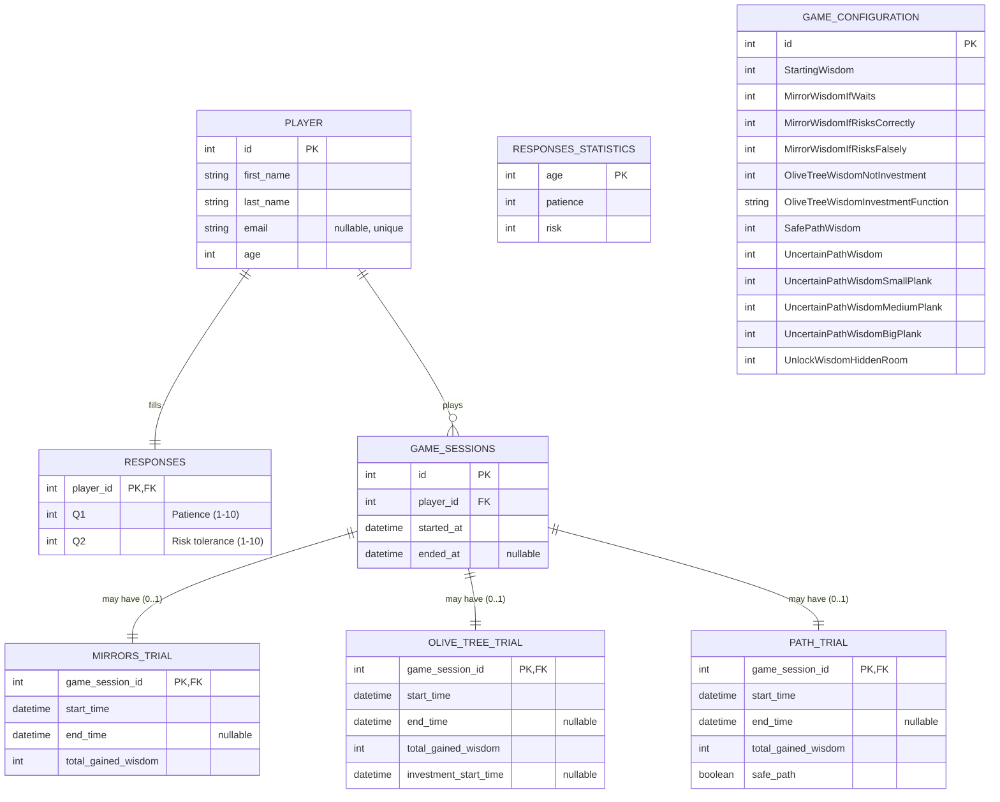

# Database Relationships

## Περιγραφές Σχέσεων
- PLAYER → RESPONSES: One-to-One. Κάθε παίκτης έχει ακριβώς μία εγγραφή στο `RESPONSES`. Το `player_id` είναι PK και FK προς `PLAYER.id`.
- PLAYER → GAME_SESSIONS: One-to-Many. Ένας παίκτης μπορεί να έχει πολλές συνεδρίες.
- GAME_SESSIONS → Trials (MIRRORS/OLIVE_TREE/PATH): Each GAME_SESSION μπορεί να έχει το πολύ ένα trial ανά τύπο (0..1). Αυτό υλοποιείται με `*_TRIAL.game_session_id` ως PK+FK προς `GAME_SESSIONS.id`.
- `OLIVE_TREE_TRIAL.investment_start_time`: nullable. Αν είναι NULL → άμεση συγκομιδή. Χρόνος αναμονής = `end_time - investment_start_time` (όταν δεν είναι NULL).
- `PATH_TRIAL.safe_path`: boolean που δηλώνει αν επιλέχθηκε ο ασφαλής δρόμος.
- `RESPONSES_STATISTICS`: Standalone table με age-based statistics για patience και risk values. Χρησιμοποιείται για comparisons.

## Περίληψη Σχέδων (Table Schemas)
- PLAYER
  - PK: `id`
  - Fields: `first_name`, `last_name`, `email (nullable, unique)`, `age`
- RESPONSES
  - PK/FK: `player_id` → `PLAYER.id`
  - Fields: `Q1 (Patience 1-10)`, `Q2 (Risk tolerance 1-10)`
- RESPONSES_STATISTICS
  - PK: `age`
  - Fields: `patience`, `risk`
- GAME_SESSIONS
  - PK: `id`
  - FK: `player_id` → `PLAYER.id`
  - Fields: `started_at`, `ended_at (nullable)`
- MIRRORS_TRIAL
  - PK/FK: `game_session_id` → `GAME_SESSIONS.id` (0..1)
  - Fields: `start_time`, `end_time (nullable)`, `total_gained_wisdom`
- OLIVE_TREE_TRIAL
  - PK/FK: `game_session_id` → `GAME_SESSIONS.id` (0..1)
  - Fields: `start_time`, `end_time (nullable)`, `total_gained_wisdom`, `investment_start_time (nullable)`
- PATH_TRIAL
  - PK/FK: `game_session_id` → `GAME_SESSIONS.id` (0..1)
  - Fields: `start_time`, `end_time (nullable)`, `total_gained_wisdom`, `safe_path (boolean)`
- GAME_CONFIGURATION
  - PK: `id`
  - Fields: tuning params (see schema above). Συνιστάται versioning και `is_active` flag.

## Χρήση Πινάκων (σύντομη)
- PLAYER
  - Webform: create/update παίκτη.
  - In-Game: ελεγχος υπαρξης του δοσμενου id
  - Admin: -
- RESPONSES
  - Webform: αποθήκευση Q1–Q2 (Patience & Risk)
  - Admin: -
  - In-Game: -
- RESPONSES_STATISTICS
  - System: age-based statistics για patience και risk comparisons
  - Admin: read-only reference data
  - In-Game: comparison calculations
- GAME_SESSIONS
  - In-Game: INSERT `started_at` στην έναρξη, UPDATE `ended_at` στο τέλος.
  - Admin: -
  - Webform: -
- MIRRORS_TRIAL / OLIVE_TREE_TRIAL / PATH_TRIAL
  - In-Game: INSERT row per trial type only when that trial occurs (game_session_id = session.id). UPDATE with `end_time`, `total_gained_wisdom`, (για OLIVE_TREE: `investment_start_time` όταν επιλέγεται).
  - Admin: -
  - Webform: -
- GAME_CONFIGURATION
  - Admin: σεταρισμα παραμετρων.
  - In-Game: read-only ανά session boot - χρησιμοποιείται για υπολογισμό ανταμοιβών.

