# Database Relationships

```mermaid
erDiagram
  PLAYER {
    int id PK
    string first_name
    string last_name
    string email "UNIQUE, NULLABLE"
    int age
  }

  RESPONSES {
    int player_id PK, FK
    int Q1 "Patience (1-10)"
    int Q2 "Risk tolerance (1-10)"
  }

  GAME_SESSIONS {
    int id PK
    int player_id FK
    datetime started_at
    datetime ended_at "nullable"
  }

  MIRRORS_TRIAL {
    int game_session_id PK, FK
    datetime start_time
    datetime end_time "nullable"
    int total_gained_wisdom
  }

  OIL_TREE_TRIAL {
    int game_session_id PK, FK
    datetime start_time
    datetime end_time "nullable"
    int total_gained_wisdom
    datetime investment_start_time "nullable"
  }

  PATH_TRIAL {
    int game_session_id PK, FK
    datetime start_time
    datetime end_time "nullable"
    int total_gained_wisdom
    boolean safe_path
  }

  GAME_CONFIGURATION {
    int id PK
    int StartingWisdom
    int MirrorWisdomIfWaits
    int MirrorWisdomIfRisksCorrectly
    int MirrorWisdomIfRisksFalsely
    int OilTreeWisdomNotInvestment
    string OilTreeWisdomInvestmentFunction
    int SafePathWisdom
    int UncertainPathWisdom
    int UncertainPathWisdomSmallPlank
    int UncertainPathWisdomMediumPlank
    int UncertainPathWisdomBigPlank
  }

  RESPONSES_STATISTICS {
    int age PK
    int patience
    int risk
  }

  PLAYER ||--|| RESPONSES : "fills"
  PLAYER ||--o{ GAME_SESSIONS : "plays"
  GAME_SESSIONS ||--|| MIRRORS_TRIAL : "may have (0..1)"
  GAME_SESSIONS ||--|| OIL_TREE_TRIAL : "may have (0..1)"
  GAME_SESSIONS ||--|| PATH_TRIAL : "may have (0..1)"
  RESPONSES_STATISTICS ||--o{ PLAYER : "age-based comparison"
```

## Περιγραφές Σχέσεων
- **PLAYER → RESPONSES**: One-to-One. Κάθε παίκτης έχει ακριβώς μία εγγραφή στο `RESPONSES`. Το `player_id` είναι PK και FK προς `PLAYER.id`.
- **PLAYER → GAME_SESSIONS**: One-to-Many. Ένας παίκτης μπορεί να έχει πολλές συνεδρίες.
- **GAME_SESSIONS → Trials** (MIRRORS/OIL_TREE/PATH): Each GAME_SESSION μπορεί να έχει το πολύ ένα trial ανά τύπο (0..1). Αυτό υλοποιείται με `*_TRIAL.game_session_id` ως PK+FK προς `GAME_SESSIONS.id`.
- **RESPONSES_STATISTICS → PLAYER**: One-to-Many lookup relationship. Χρησιμοποιείται για σύγκριση των απαντήσεων Q1/Q2 με βάση την ηλικία.

## Σημαντικές Αλλαγές από Προηγούμενη Έκδοση
- **Email**: Τώρα nullable και προαιρετικό (UNIQUE constraint παραμένει για unique emails όταν δίνονται)
- **Q3**: Αφαιρέθηκε από RESPONSES - μόνο Q1 (Patience) και Q2 (Risk) παραμένουν
- **RESPONSES_STATISTICS**: Νέος πίνακας με age-based δεδομένα για comparison
- **end_time**: Όλα τα trial tables έχουν nullable end_time (για ongoing trials)

## Λεπτομέρειες Πεδίων
- **PLAYER.email**: nullable, unique constraint για αποφυγή duplicates
- **RESPONSES.Q1**: Patience level (1-10), maps to RESPONSES_STATISTICS.patience
- **RESPONSES.Q2**: Risk tolerance (1-10), maps to RESPONSES_STATISTICS.risk
- **OIL_TREE_TRIAL.investment_start_time**: nullable. Αν είναι NULL → άμεση συγκομιδή. Χρόνος αναμονής = `end_time - investment_start_time` (όταν δεν είναι NULL).
- **PATH_TRIAL.safe_path**: boolean που δηλώνει αν επιλέχθηκε ο ασφαλής δρόμος.
- **RESPONSES_STATISTICS**: Περιέχει 63 εγγραφές (ages 18-80) με expected patience/risk values

## Περίληψη Σχέδων (Table Schemas)
- **PLAYER**
  - PK: `id` (SERIAL)
  - Fields: `first_name` (VARCHAR(100) NOT NULL), `last_name` (VARCHAR(100) NOT NULL), `email` (VARCHAR(255) UNIQUE, nullable), `age` (INTEGER NOT NULL)
- **RESPONSES**
  - PK/FK: `player_id` → `PLAYER.id` (CASCADE DELETE)
  - Fields: `Q1` (INTEGER NOT NULL - Patience 1-10), `Q2` (INTEGER NOT NULL - Risk 1-10)
- **GAME_SESSIONS**
  - PK: `id` (SERIAL)
  - FK: `player_id` → `PLAYER.id` (CASCADE DELETE)
  - Fields: `started_at` (TIMESTAMP DEFAULT CURRENT_TIMESTAMP), `ended_at` (TIMESTAMP NULL)
- **MIRRORS_TRIAL**
  - PK/FK: `game_session_id` → `GAME_SESSIONS.id` (0..1, CASCADE DELETE)
  - Fields: `start_time` (TIMESTAMP NOT NULL), `end_time` (TIMESTAMP NULL), `total_gained_wisdom` (INTEGER NOT NULL)
- **OIL_TREE_TRIAL**
  - PK/FK: `game_session_id` → `GAME_SESSIONS.id` (0..1, CASCADE DELETE)
  - Fields: `start_time` (TIMESTAMP NOT NULL), `end_time` (TIMESTAMP NULL), `total_gained_wisdom` (INTEGER NOT NULL), `investment_start_time` (TIMESTAMP NULL)
- **PATH_TRIAL**
  - PK/FK: `game_session_id` → `GAME_SESSIONS.id` (0..1, CASCADE DELETE)
  - Fields: `start_time` (TIMESTAMP NOT NULL), `end_time` (TIMESTAMP NULL), `total_gained_wisdom` (INTEGER NOT NULL), `safe_path` (BOOLEAN NOT NULL)
- **GAME_CONFIGURATION**
  - PK: `id` (SERIAL)
  - Fields: Tuning parameters (11 wisdom-related values) - default configuration inserted
- **RESPONSES_STATISTICS**
  - PK: `age` (INTEGER 18-80)
  - Fields: `patience` (INTEGER NOT NULL), `risk` (INTEGER NOT NULL)
  - Data: 63 pre-populated rows with age-based expected values

## Χρήση Πινάκων (σύντομη)
- **PLAYER**
  - Registration Form: create παίκτη με optional email
  - In-Game: έλεγχος ύπαρξης του δοσμένου id
  - Statistics API: lookup by age for comparison
- **RESPONSES**
  - Registration Form: αποθήκευση Q1 (Patience) & Q2 (Risk)
  - Statistics API: comparison με RESPONSES_STATISTICS based on age
  - In-Game: read-only για game logic
- **GAME_SESSIONS**
  - In-Game: INSERT `started_at` στην έναρξη, UPDATE `ended_at` στο τέλος
  - Statistics API: lookup completed sessions για analysis
- **MIRRORS_TRIAL / OIL_TREE_TRIAL / PATH_TRIAL**
  - In-Game: INSERT row per trial type only when that trial occurs (game_session_id = session.id). UPDATE with `end_time`, `total_gained_wisdom`, (για OIL_TREE: `investment_start_time` όταν επιλέγεται)
  - Statistics API: data για detailed game performance analysis
- **GAME_CONFIGURATION**
  - Admin: σετάρισμα παραμέτρων (default configuration exists)
  - In-Game: read-only ανά session boot - χρησιμοποιείται για υπολογισμό ανταμοιβών
- **RESPONSES_STATISTICS**
  - Statistics API: age-based lookup για Q1/Q2 comparison
  - Admin: reference data (63 pre-populated age entries)
  - Registration Form: indirect usage για post-registration statistics

## Performance Indexes
- `idx_game_sessions_player_id`: Optimize player session lookups
- `idx_game_sessions_started_at`: Optimize time-based queries
- `idx_player_email`: Optimize email uniqueness checks and lookups

## API Endpoints που χρησιμοποιούν τους πίνακες
- `POST /api/player/register`: PLAYER, RESPONSES
- `GET /api/player/{id}`: PLAYER, RESPONSES, GAME_SESSIONS
- `GET /api/game/statistics/{sessionId}`: GAME_SESSIONS, PLAYER, RESPONSES, RESPONSES_STATISTICS
- Game endpoints (future): όλοι οι πίνακες ανάλογα με το gameplay

