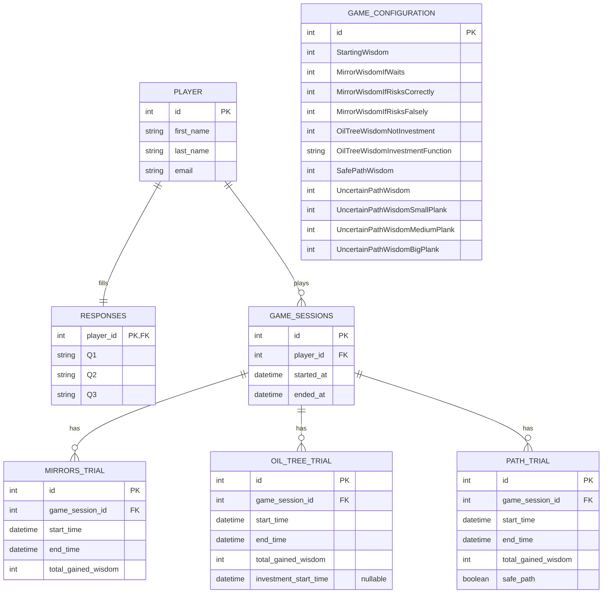

## Entity Relationship Diagram

### Relationship notes

- PLAYER ↔ RESPONSES: 1–1, το `player_id` είναι PK & FK (όπως πριν).
- PLAYER ↔ GAME_SESSIONS: 1–N (ένας παίκτης παίζει πολλές συνεδρίες).
- GAME_SESSIONS ↔ Trials: 1–N (κάθε συνεδρία έχει πολλά trials από κάθε τύπο).
- `OIL_TREE_TRIAL.investment_start_time`: επιτρέπεται NULL.
  - Αν μάζεψε αμέσως → NULL.
  - Αν επέλεξε Investment → set όταν πάτησε το κουμπί.
  - Χρόνος αναμονής = end_time - investment_start_time.
- `PATH_TRIAL.safe_path`: boolean (αν ακολούθησε τον ασφαλή δρόμο).